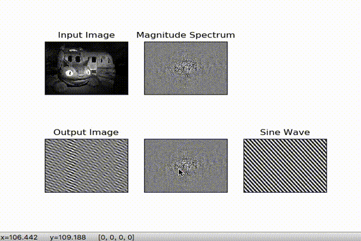

1.どんな処理を実装したのか
--------------
はじめに画像を読み込み、サイズが大きい場合は縮小する。
次に読み込んだ画像をグレースケールで表示する。その後、その画像をフーリエ変換する。
左上に元画像、真ん中上下にパワースペクトル、左下にクリックしたsin波を重ね合わせたもの、右下にクリックしたところのsin波を表示する。
さらに、マウスイベントごとにコードを設定し、sin波を更新するようにした。
 
2.依存ライブラリとバージョン
-------------
Pillow(5.4.1),numpy(1.16.2),matplotlib(3.0.3)
  
3.参考にしたサイトのリンク
-------------
「Python関連―十河研究室」 http://www.s12600.net/psy/etc/python.html
の「2次元Fourier変換で遊ぶFFT2demo」の「FFT2demo.py」のコードを参考にした。

4.実行の様子をgifアニメーションで表示
-------------
「Ctrl+左クリック」したところのサイン波を右に表示し、サイン波を重ね合わせたものを左に表示した。

